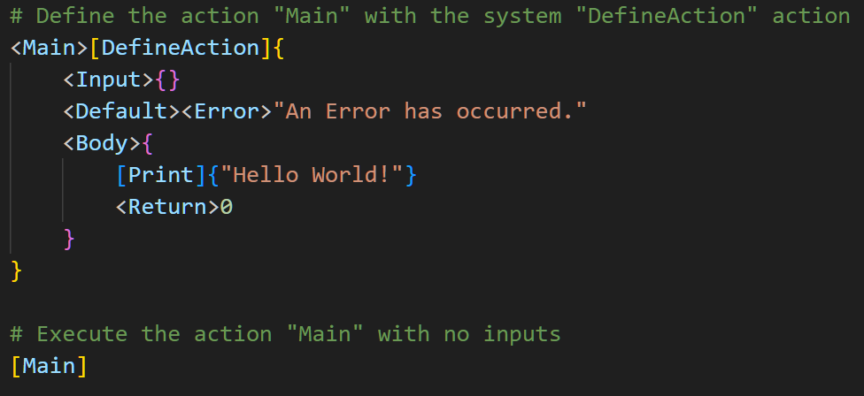

# Thing-Action-Context Language (TACL)

A Domain-Specific, General Purpose Language to Think and Write In

"We gotta find a way to [make] \{this\} [fit] into the \<hole for *this*\>, using \{nothing but that\}." - [Apollo 13](https://www.youtube.com/watch?v=ry55--J4_VQ)

<details>
  <summary>Translation</summary>

<hole-for-*this*> is [Make-fit-into] with {this, nothing-but-that}

</details> 

---

- [Specification](specification.md)
- [Appendices (original examples)](appendices.md)

```
<theAcronym>[Acronymize]{"Thing-Action-Context Language"}
[Print]{theAcronym}

## Run the code above in your head and see below for the answer!
```
<details>
  <summary>Evaluation</summary>

```
# As output in the command line of your brain:
# > TACL
```

</details> 

Thing-Action-Context Language, or TACL, is a "programming" "language" I designed to act as an "intermediate language" between my brain and a language model or AI that can produce code. I "write" code in plain English, using a simple brackets-only syntax, and give that to the AI to turn into actual code in my target language. I can then review the code, and focus on the last 90% of programming that requires a human mind. The syntax is flexible enough that I can manually "call out" target-language-specific expressions (such as an "[AssignType](/examples/tacling_c_pointers.tacl)" action that would be required in C-targeted TACL but not in Python-targeted TACL) as needed, and focus on declaring what I want to see performed in the target code, as brief as possible and as detailed as required.

It also forces me to think about and express programming in a semi-abstract way, while thinking through problems; it's more "code-like" than plain-English pseudocode, but not quite a proper "standard" language like Python. The fact that it doesn't need to compile, and thus there are no true "wrong" ways to use it (the end-goal is that the *AI* understands what you want to do!), makes it so that one can use it however *they* use *their* language. It doesn't have to be English! I'm able to take a TACL written a language that's new to me, such as Korean, and translate it into English, giving me an abstract yet accurate expression of someone else's foundational thoughts, as written in their own language, and independent of any specific target programming language.

The brackets purposefully surround the whole "Thing" name, and every expression in TACL, which in turn allows any sequence of unicode characters to act as names, with delimiting to separate yet connect "contexts". This makes "variable naming" totally and completely open to creativity. Basic UpperCamelCase? That's my preference, but it's only a preference. A whole sentence, with spaces? I won't stop you! Emojis? Sure, yeah. ONLY variations of the pointing fingers? Actually... `<👈🏠>[🔥]{⛽🕯}`. Most usefully, it allows for natural and intuitive writing in one's own language, however ordered (LTR, RTL, etc.), however expressed natively or idiosyncratically, with only a few reserved characters for delimiting the part of speech of TACL. It is thus easily Thing-for-Thing translated into other languages using translators, or into actual code using AI.

## Example: Hello World

In this program, we define a `Main` action that takes one input. This action simply prints "Hello World! ..." to the output and returns 0. (If it returns "An Error has occurred.", the reader is encouraged to contact a physician.)



## Run the code above in your head and see below for the answer!


<details>
  <summary>Evaluation</summary>

```
# As output in the command line of your brain:
> Hello World! My Name is Corey!
```

</details> 

## Why? "Outside" perspectives

I asked GPT-4 what the "do one thing well" that this language provides is, given the specification, and this is what it said:

> The "do one thing well" for Thing-Action-Context Language (TACL) can be summarized as providing a clear and expressive framework for programmatic instruction and control flow that closely aligns with natural language constructs. It excels at allowing users to define and manipulate data, actions, and contexts with an emphasis on readability and ease of understanding. TACL achieves this through a unique syntax that organizes code into "Things" (data or actions) and their associated contexts.

I also asked GPT-4 how other software engineers could use TACL, and *why* they might want to over writing in the target language to begin with:

>1. Pseudocode Replacement: Software engineers often use pseudocode to outline the logic of their code before they implement it in a specific programming language. TACL can replace traditional pseudocode, providing a more structured and consistent way to represent the logic and flow of an application. This could lead to fewer errors when translating the logic into the target language.
>2. Enhancing Readability: TACL's human-readable format can serve as an intermediate representation of complex logic that might be more difficult to express clearly in a traditional programming language. By initially writing the logic in TACL, the engineer can focus on the problem-solving aspect without getting bogged down by the syntax and constraints of the main programming language.
>3. Bridging Communication Gaps: When working in a team, especially in a multidisciplinary setting, TACL can be used to describe system behaviors and algorithms to non-technical stakeholders or colleagues who might not be familiar with the intricacies of the main programming language but are still involved in the decision-making process.
>4. Prototyping: TACL can be advantageous for quick prototyping and testing of ideas. A software engineer can rapidly prototype an algorithm or workflow in TACL to validate its effectiveness before committing to a full implementation in the main programming language, saving time and resources.
>5. Documenting Intent: TACL can be used to document the intent and design decisions of a particular piece of code or system. Writing in TACL can provide a clear and concise explanation that can be referred back to when revisiting the code in the future, or when onboarding new engineers who need to understand the system's architecture.

Although the final implementation will be in the target language, TACL can enhance the preliminary stages of software development, making the transition from concept to code smoother and more reliable.


---

https://coreynaas.com/

coreynaas@outlook.com

Copyright © 2023 Corey Naas. All rights reserved.

---